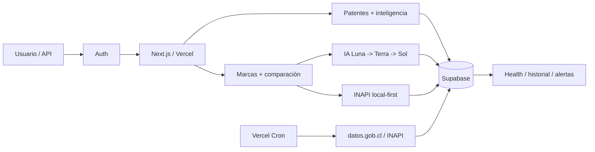

# Visual Compare Chile
## Dossier final de funcionamiento, alcance y entrega

**Documento para entrega al cliente**  
**Versión:** 2.0  
**Fecha de corte:** 22 de agosto de 2026

---

## 1. Resumen ejecutivo

Visual Compare Chile es una plataforma de inteligencia de propiedad industrial para apoyar análisis preliminar de marcas, comparación visual, consulta de antecedentes oficiales, clasificación Niza/Viena, Patent Intelligence, Competitive Intelligence y vigilancia competitiva.

La solución combina una aplicación web, una API v1, una base local sincronizada con fuentes oficiales INAPI, capacidades de IA multimodelo y trazabilidad persistente. Su objetivo es reducir trabajo manual, mejorar velocidad de investigación y conservar evidencia suficiente para revisión humana.

Los resultados son orientativos. La plataforma no sustituye una decisión de INAPI ni una opinión jurídica profesional.

---

## 2. Capacidades entregadas

### Marcas

- evaluación preliminar por nombre;
- carga opcional de logo/signo;
- clasificación Niza;
- clasificación Viena para elementos figurativos;
- antecedentes INAPI trazables;
- resumen ejecutivo y nivel de riesgo;
- comparación visual de imágenes;
- historial y detalle persistido.

### Datos oficiales

- mirror local de marcas INAPI en Supabase;
- búsqueda fuzzy y tolerante a tildes;
- verificación live selectiva;
- sincronización automática diaria desde Datos Abiertos de INAPI/datos.gob.cl;
- health de frescura de datos.

### Patentes

- búsqueda por título/tecnología;
- búsqueda por solicitante/empresa;
- filtros IPC;
- solicitantes, inventores, estados y fechas;
- Competitive Intelligence por empresa;
- backfill histórico autónomo 2009–2025;
- alertas competitivas por empresa o prefijo IPC.

### Integración y operación

- API v1;
- API keys, cuotas y rate limiting;
- health endpoint;
- Vercel Cron;
- observabilidad de sync;
- CI TypeScript + build;
- CodeQL;
- Dependabot;
- CODEOWNERS;
- política de seguridad versionada.

---

## 3. Arquitectura resumida

---

## 4. IA y control de costo

El sistema utiliza un router multimodelo orientado a costo/confianza:

1. **Luna** como tier por defecto para volumen;
2. **Terra** cuando la confianza no alcanza el umbral;
3. **Sol** sólo para casos ambiguos o críticos.

Las respuestas se validan mediante Structured Outputs y Zod. Se evita depender de JSON libre o parsers regex. El pipeline puede registrar modelo, tier, tokens, escalamiento y costo estimado.

Este diseño permite mantener el costo medio bajo sin renunciar a modelos de mayor capacidad cuando realmente agregan valor.

---

## 5. INAPI y continuidad operacional

La arquitectura de marcas es local-first. La consulta normal se realiza sobre Supabase y sólo verifica INAPI live cuando corresponde. Esto reduce dependencia de un endpoint web no diseñado como API pública estable.

La sincronización diaria utiliza los Datos Abiertos oficiales. El health marca la frescura de marcas y patentes; si la fuente supera el threshold operativo, el sistema puede reportarse degradado.

Para patentes, el cron actualiza el año vigente, detecta alertas y luego avanza el backfill histórico. Ese orden evita presentar patentes antiguas como eventos nuevos.

---

## 6. Seguridad

La plataforma implementa:

- Supabase Auth;
- RLS para datos privados y alertas;
- service role sólo server-side;
- `CRON_SECRET` para el job diario;
- API keys protegidas para integraciones;
- no exposición de secretos en health;
- CI y análisis de seguridad del código;
- validación estructurada de outputs de IA.

Las cuentas administrativas de GitHub, Vercel, Supabase, OpenAI y DNS deben quedar bajo control formal del cliente o del responsable acordado.

---

## 7. Recorrido recomendado para demostración

1. iniciar sesión;
2. abrir `/dashboard`;
3. ejecutar una evaluación por nombre en `/agente`;
4. repetir con logo para mostrar Viena y análisis visual;
5. abrir una búsqueda INAPI y explicar local-first + fuente/frescura;
6. mostrar historial/detalle;
7. abrir `/patentes` y buscar una tecnología o empresa;
8. abrir perfil competitivo;
9. crear una vigilancia en `/patentes/alertas`;
10. mostrar `/api/v1/health` y explicar sincronización automática;
11. mostrar API Playground si la entrega incluye integración.

---

## 8. Estado de producción al corte

La revisión productiva vigente al cierre de la documentación responde correctamente en Vercel. El health se verificó `200 OK`, con mirrors de marcas y patentes en estado `fresh` y sincronización automática configurada.

El repositorio cuenta además con checks independientes de Vercel para TypeScript y build productivo, y CodeQL para JavaScript/TypeScript.

---

## 9. Documentación final de entrega

La entrega completa vive en:

- `docs/entrega-cliente/README.md`
- `docs/entrega-cliente/MANUAL_USUARIO.md`
- `docs/entrega-cliente/ARQUITECTURA_OPERACION.md`
- `docs/entrega-cliente/SEGURIDAD_MANTENIMIENTO.md`
- `docs/entrega-cliente/CHECKLIST_ACEPTACION.md`

La documentación técnica complementaria incluye `README.md`, `API_V1_DOCUMENTATION.md`, `SECURITY.md`, `ROADMAP.md` y los documentos de arquitectura del repositorio.

---

## 10. Cierre

Visual Compare Chile se entrega como una plataforma operativa y extensible, no como una demo aislada. La combinación de datos oficiales, búsqueda local, IA estructurada, patentes, alertas, API, sincronización automática, observabilidad y controles de seguridad permite operar el producto con trazabilidad y una base clara para evolución futura.

**Mensaje para el cliente:** la plataforma centraliza investigación de propiedad industrial y convierte procesos repetitivos en un flujo más rápido, auditable y medible, manteniendo siempre la revisión profesional como última instancia.