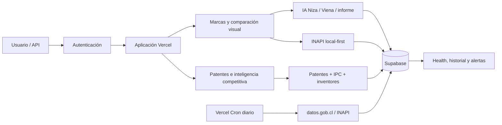

# Entrega final al cliente — Visual Compare Chile

**Fecha de corte:** 22 de agosto de 2026  
**Estado:** producción operativa en Vercel  
**Base de datos y autenticación:** Supabase  
**Fuente oficial de propiedad industrial:** INAPI / Datos Abiertos en datos.gob.cl

Este directorio reúne la documentación de entrega del producto en un formato orientado al cliente. La documentación técnica interna del repositorio sigue existiendo, pero estos documentos son la referencia para presentación, capacitación, aceptación y operación.

## Documentos de entrega

1. **[Manual de usuario](MANUAL_USUARIO.md)** — recorrido funcional del sitio, módulos, flujos, resultados y buenas prácticas.
2. **[Arquitectura y operación](ARQUITECTURA_OPERACION.md)** — cómo funciona la plataforma, datos, IA, sincronización, alertas, salud y continuidad.
3. **[Seguridad, mantenimiento y soporte](SEGURIDAD_MANTENIMIENTO.md)** — controles de acceso, secretos, CI, monitoreo, responsabilidades y mantenimiento recomendado.
4. **[Checklist de entrega y aceptación](CHECKLIST_ACEPTACION.md)** — verificación funcional y técnica para el cierre con el cliente.

## Alcance entregado

Visual Compare Chile es una plataforma de inteligencia de propiedad industrial que integra:

- análisis preliminar de marcas;
- comparación visual de imágenes;
- clasificación Niza y Viena;
- búsqueda y evidencia INAPI;
- historial y trazabilidad;
- Patent Intelligence;
- Competitive Intelligence por empresa e IPC;
- alertas competitivas;
- API v1 con autenticación y cuotas;
- sincronización automática diaria con datos oficiales;
- arquitectura multimodelo de IA orientada a costo/confianza;
- observabilidad, health checks y controles de seguridad.

## Principio de uso

Los resultados son **orientativos** y sirven para apoyar análisis, investigación y priorización. No constituyen por sí solos una decisión jurídica de registrabilidad, concesión de patente o infracción, y deben complementarse con revisión profesional cuando el contexto lo requiera.

## Flujo general

## Estado de producción validado

Al cierre de esta documentación:

- el deployment de producción responde correctamente;
- `/api/v1/health` responde `200 OK`;
- el mirror INAPI de marcas se reporta `fresh`;
- el mirror INAPI de patentes se reporta `fresh`;
- el histórico oficial de solicitudes de patentes **2009–2025 está completo: 17/17 años**;
- no existen números de solicitud de patente duplicados en el corpus auditado;
- el corpus INAPI de patentes contiene **56.637 expedientes** y **174.446 relaciones IPC** al corte;
- las métricas interanuales de Competitive Intelligence quedaron habilitadas automáticamente al completarse la cobertura histórica;
- CI, TypeScript, build productivo y CodeQL están habilitados en el repositorio;
- la sincronización diaria está configurada mediante Vercel Cron y `CRON_SECRET`.

Las cifras de registros son una fotografía operativa del corte y continuarán cambiando con las sincronizaciones oficiales posteriores.

## Documento contractual vs. documento operativo

Este paquete describe el estado funcional y operativo observado al corte indicado. Si se utiliza como anexo contractual, conviene incorporar además: responsables nominales, SLA acordado, dominio definitivo, contactos de soporte, propiedad de cuentas cloud y cualquier compromiso comercial específico.
